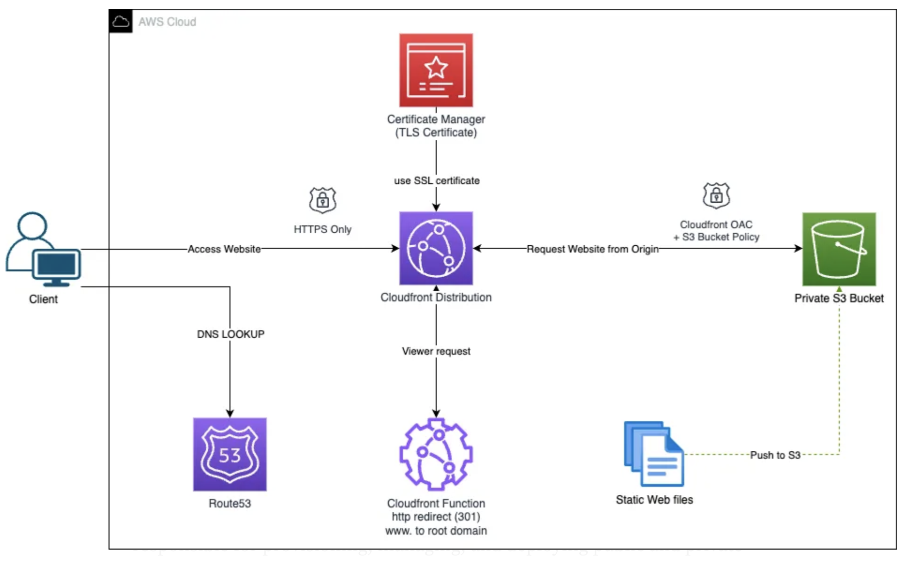

# Hosting static website using AWS S3 and cloud-front

Description: This is a first and very simple approach where we have simple static website using AWS S3 bucket and AWS CloudFront for DNS.

The requirement is to host static website with "hello-world" level of complexity using terraform.

Approach:
1. Find an existing terraform module using Terraform module registry website.
2. There are many terraform modules that does the job but I choose this module - [chgangaraju/cloudfront-s3-website/aws](https://registry.terraform.io/modules/chgangaraju/cloudfront-s3-website/aws/latest) for no specific reason
3. I assumed that the website does not require a special html page and hence kept the original version the the index.html; which gets automatically created.

# Architecture 





Checks against the documented requirements:
1. AWS S3 is a scalable object store with minimal cost
2. AWS CloudFront is a edge service; which does automatic DNS hosting with TLS/SSL security.
3. We can create multiple instances of this deployments withtout any issue.


## Terraform state file
For a sake of simplicity, I am keeping the Terraform state file on local storage but this can be hosted on AWS S3 and Terraform lock file using DynamoDB table on AWS.

## AWS Credentails
AWS Credentials are stored in `~/.aws/credentials` file

## Maintenance of chosen solution:
1. Uptime - CloudFront and AWS S3 covers most aspect of High Avalability
2. New releases - AWS S3 bucket versioning has been enabled to keep new version of the website static pages. We can keep version of the application in separate repository for versioning and upload it to AWS S3 bucket using terraform provider.
3. Code re-usability - As this is a Terraform module, we can pretty much import into any setup and customise as required.
4. Improvement - We can provision custom domain using Route53 and integrate in this module.

## Pre-requisite
- Terraform (1.2.*^)
- An AWS account
- A terminal with the AWS CLI installed and configured


# Quick start
To provision the required AWS Resources you need to have AWS Account, AWS Credentails (~/.aws/credentails) in default profile.

## Initialie the terraform
```shell
terraform init
```

## Plan

```shell
terraform plan
```

## Apply

```shell
terraform apply --auto-approve
```

## Destroy or clean-up

```shell
terraform destroy --auto-approve
```